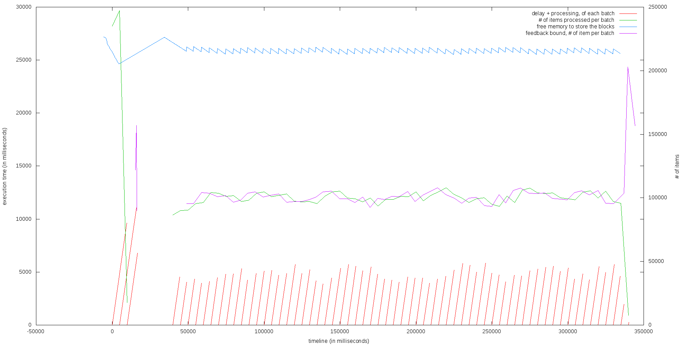
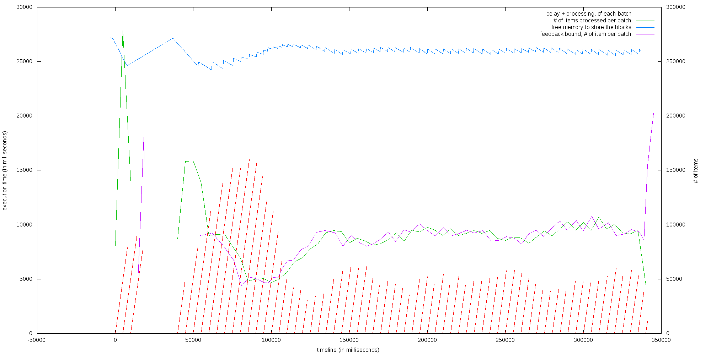
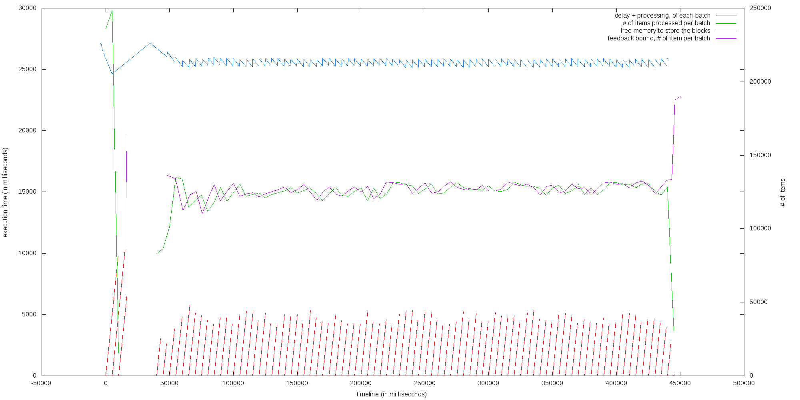

# Test runs

__For setup and all other details, look below__

## vanilla Spark 1.4.0, TCP receiver, no congestion strategy

Not run again.

## streaming back pressure branch, TCP receiver, congestion strategy: ignore

Not run again.

## streaming back pressure branch, TCP receiver, congestion strategy: drop

Using [1.4.0-streaming-t005](https://downloads.typesafe.com/typesafe-spark/test/builds/spark-1.4.0-streaming-t005-bin-2.4.0.tgz).



* a good feedback value is generated during the warm-up phase.
* during the main test phase, feedback regulates the input size
* no delay build-up
* the memory usage is stable.
* the test run to completion.

## streaming back pressure branch, TCP receiver, congestion strategy: sampling

Using [1.4.0-streaming-t005](https://downloads.typesafe.com/typesafe-spark/test/builds/spark-1.4.0-streaming-t005-bin-2.4.0.tgz).



* a high feedback value is generated during the warm-up phase.
* during the main test phase, the job initialy takes longer than the batch interval to run.
  * the some delay accumulate.
* feedback starts:
  * first, limits the input size to be able to handle it during one batch interval.
  * then, limits more to reduce the accumulated delay.
  * when the delay is resorbed, sets back the limit so the input can be to handled during one batch interval. 
* the memory usage is stable.
* the test run to completion.

## streaming back pressure branch, TCP receiver, congestion strategy: pushback

Using [1.4.0-streaming-t005](https://downloads.typesafe.com/typesafe-spark/test/builds/spark-1.4.0-streaming-t005-bin-2.4.0.tgz).



* a low feedback value is generated during the warm-up phase.
* during the main test phase, feedback adjusts up the limit value, then regulates the input size
* no delay build-up
* the memory usage is stable.
* the test should stop after 342 secondes, but data is still incoming for 80 more seconds
  * the testbed application has to be fixed to manage the pushback coming from TCP

## streaming back pressure branch, reactive receiver

Not available for this test runs.

# Setup

The tests were executed on 3 m3.large ubuntu instances:

* 1 instance running the testbed application, providing the stream of data
* 2 instances running a 2 nodes Spark cluster:
  * node 1: Spark master + Spark slave
  * node 2: Spark streaming application + Spark slave\

## Test scenario

The test scenario is run using the [testbed application](https://github.com/skyluc/spark-streaming-testbed/tree/master/testbed).

binary: [spark-streaming-testbed-0.1.0](https://downloads.typesafe.com/typesafe-spark/test/spark-streaming-testbed/spark-streaming-testbed-0.1.0.zip)

It is a Play/Akka application which pushes a stream of numbers to clients connected to a specific port.

The test configuration is the following:

```
sequence = [
  { type = noop    # warm-up
    duration = 2
  }
  { type = fixed
    value = 7
    rate = 50000
    duration = 10
  }
  { type = noop
    duration = 30
  }
  { type = fixed   # actual test
    value = 7
    rate = 50000
    duration = 300
  }
]
```

The test scenario is a series of number `6`, sent at the rate of 50k per seconds.

## Test streaming application


The test streaming application does a resolution of the tower of Hanoi problem, for each number of the input stream. The number is used as the height of the tower.

Then does some statistics on the data from the batch: for each distinct value received:

* the number of time the value appears in the batch,
* the accumulated processing time
* the average processing time
* the standard deviation of the processing time.

source: [simple-streaming-app](https://github.com/skyluc/spark-streaming-testbed/tree/master/simple-streaming-app)

binary: [simple-streaming-app_2.10-0.1.6.jar](https://downloads.typesafe.com/typesafe-spark/test/simple-streaming-app/simple-streaming-app_2.10-0.1.6.jar)

### streaming application execution

The application is launched using: 

```
bin/spark-submit --class com.typesafe.spark.SimpleStreamingApp --master spark://<master_internal_ec2_hostname>:7077 <location/simple-streaming-app_2.10-0.1.6.jar> <testbed_ec2_internal_name> 2222 <congestion_strategy>
```

## Additional logs

Spark master, slaves and driver are running with the following additional configuration in `conf/log4j.properties`:

```
[...]
log4j.appender.console.target=System.out
[...]
log4j.appender.console.layout.ConversionPattern=%d{yyyy-MM-dd HH:mm:ss,SSSZ} %p %c{1}: %m%n
[...]

# Change this to set Spark log level
log4j.logger.org.apache.spark=WARN

log4j.logger.org.apache.spark.storage.BlockManagerInfo=INFO

log4j.logger.org.apache.spark.streaming.receiver.ReceiverSupervisorImpl=DEBUG

```

# Log processing

The log used are:

* the output from the spark-submit command, called `run.log` below.
* the standard out of the executor running the streaming receiver. See below for an example of its location, in the creation of `feedback.log`.

```bash
# extract the intresting lines
grep $'\t7\t' run.log > execution.log
# find the earliest timestamp
BASE_TIME=$(head -1 execution.log | awk '{print $2}')
# shift the time, and keep only the interesting columns
awk -v baseTime=${BASE_TIME} -F '\t' '{print $1-baseTime"\t"$2-baseTime"\t"$1-$2"\t"$4;}' execution.log > execution-processed.log
```

```bash
# extract the intresting lines
grep 'Added input' run.log > memory.log
# shift the time and normalize the memory numbers (to KB).
awk -v baseTime=${BASE_TIME} -F '[\)\, -]' '{ if ($18 == "MB") { a = $17 * 1024} else {a = $17}; if ($22 == "MB") { b = $21 * 1024 } else { b = $21 }; print $11-baseTime"\t"a"\t"b;}' memory.log > memory-processed.log
```

```bash
grep 'Received update' SPARK_HOME/work/app-xxxxxxxxxxxx-000x/x/stdout > feedback.log
awk -v baseTime=${BASE_TIME} '{ cmd = "date --date=\""$1" "$2"\" +%s%3N"; cmd | getline a ; print a - baseTime,$10 - baseTime,$12 }' feedback.log > feedback-processed.log
```

## Plots

[gnuplot script](../graph.gnuplot)

