# Test runs

__For setup and all other details, look below__

## Vanilla Spark 1.4.0, TCP receiver, no congestion strategy

Using [1.4.0-bin-hadoop2.4](http://www.apache.org/dyn/closer.cgi/spark/spark-1.4.0/spark-1.4.0-bin-hadoop2.4.tgz). Test scenario 1.

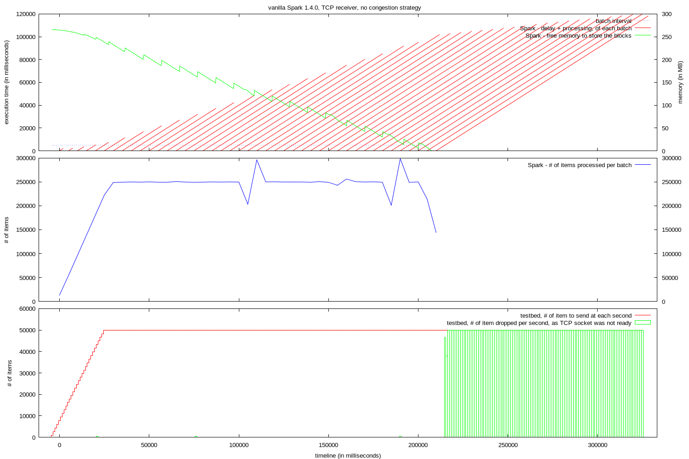

* the job takes longer than the batch interval to run.
  * the delay is accumulating.
  * the amount of memory used to store the blocks to process increase.
* when the available memory to store the blocks reaches 0
  * blocks stop being created
  * the receiver stops processing the input
* shortly after, the data sent by the test bed fills up the TCP chanel, and the test bed drops the remaining of the data.
* the data which was already stored in blocks is still processed, the last of this batches finishes with a delay of more than 100 seconds.

## Streaming back pressure branch, TCP receiver, congestion strategy: ignore

Using [1.4.0-streaming-t006](https://downloads.typesafe.com/typesafe-spark/test/builds/spark-1.4.0-streaming-t006-bin-2.4.0.tgz). Test scenario 1.

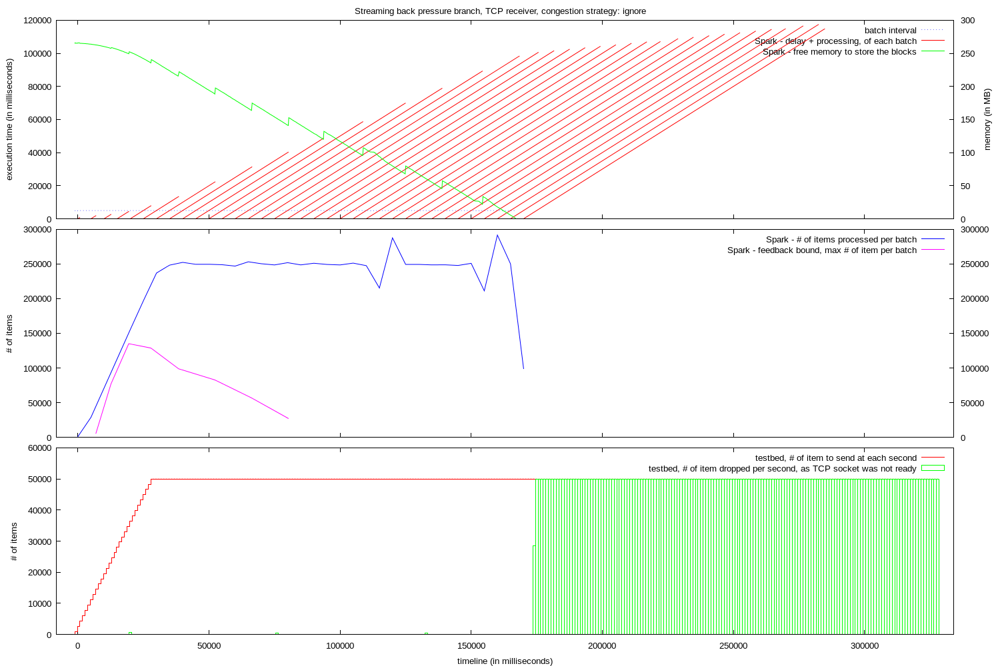

* the job takes longer than the batch interval to run.
  * the delay is accumulating.
  * the amount of memory used to store the blocks to process increase.
* The feedback bound indicates that the size of the blocks should be reduced. It is ignored (as per congestion strategy).
* when the available memory to store the blocks reaches 0
  * blocks stop being created
  * the receiver stops processing the input
* shortly after, the data sent by the test bed fills up the TCP chanel, and the test bed drops the remaining of the data.
* the data which was already stored in blocks is still processed, the last of this batches finishes with a delay of more than 100 seconds.

## Streaming back pressure branch, TCP receiver, congestion strategy: drop

Using [1.4.0-streaming-t006](https://downloads.typesafe.com/typesafe-spark/test/builds/spark-1.4.0-streaming-t006-bin-2.4.0.tgz). Test scenario 1.

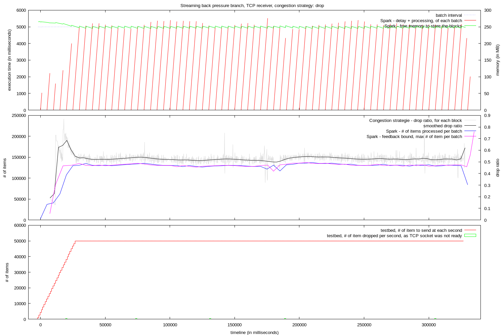

* During the test ramp-up, a good feedback bound value is generated.
* It is used through the test to limit the number of entries per batches
  * The jobs are executed without any important delay.
* The memory is stable
* The test terminates correctly. The last batches of data are processed right after the test stopped pushing input data.

## Streaming back pressure branch, TCP receiver, congestion strategy: sampling

Using [1.4.0-streaming-t006](https://downloads.typesafe.com/typesafe-spark/test/builds/spark-1.4.0-streaming-t006-bin-2.4.0.tgz). Test scenario 1.

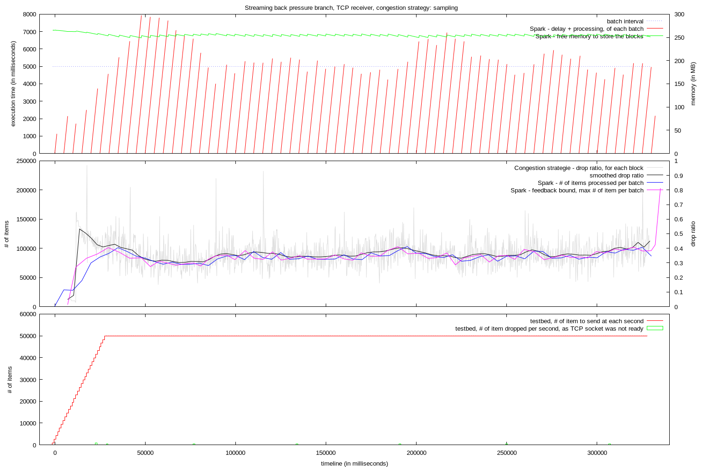

* During the test ramp-up, a feedback bound value too high is generated.
  * Some delay is accumulating as the jobs take too long to run.
* The feedback bound value is adjusted to reduce the delay.
* The feedback bound value is not really stable, as is the job execution time.
* The memory is stable
* The test terminates correctly. The last batches of data are processed right after the test stopped pushing input data.

## Streaming back pressure branch, TCP receiver, congestion strategy: pushback

Using [1.4.0-streaming-t006](https://downloads.typesafe.com/typesafe-spark/test/builds/spark-1.4.0-streaming-t006-bin-2.4.0.tgz). Test scenario 1.

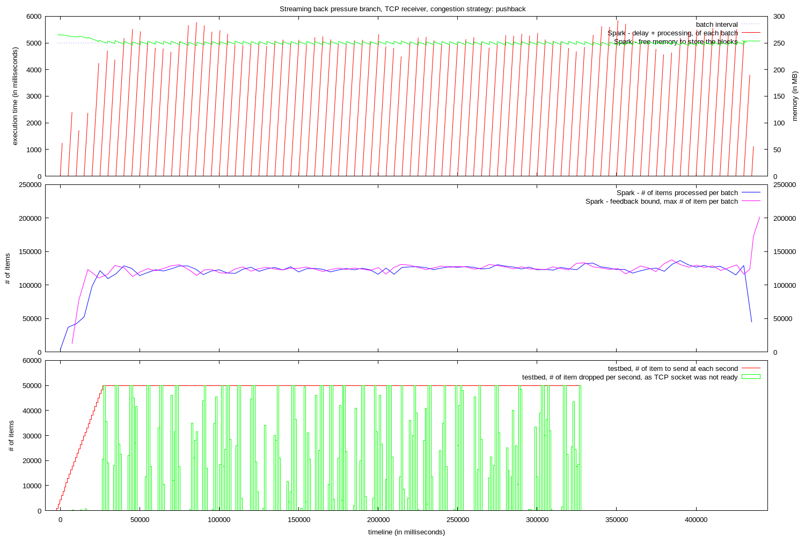

* During the test ramp-up, a good feedback bound value is generated.
  * It is used through the test to limit the number of entries per batches
* The jobs are executed without any real delay.
* The memory is stable
* As the the producing rate of input data is higher than the consuming rate of the data (pushback strategy), the testbed find itself unable to push all the test data, and drop the excess.
* The test is supposed to last about 330 seconds, but because the TCP channel was filed up with data, it takes 100 more seconds to flush and process this data.

## Streaming back pressure branch, reactive receiver

Not available for this test runs.

## Streaming back pressure branch, TCP receiver, congestion strategy: drop. Spikes?

Using [1.4.0-streaming-t006](https://downloads.typesafe.com/typesafe-spark/test/builds/spark-1.4.0-streaming-t006-bin-2.4.0.tgz). Test scenario 2, with spikes of 30 seconds.

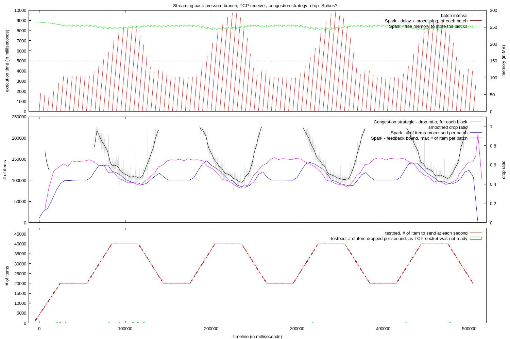

* The test starts as expected, with a rate of input data lower than what the system can process during the batch interval.
* But when the spikes append, a fair amount of delay is introduced to the system.
  * The starting feedback bound value seems too high when the rate of the input data is lower. When the spikes append too much data is take per batch to be processed during the batch interval.
* The system detect the problem and start adjusting the feedback bound value. The spikes are too short to see the actual effect of this adjustment.
* The system is stable and seem to be recovering, but:
  * The initial feedback bound value is too high to correctly manage the spikes.
* Needs more testing (see below).

## Streaming back pressure branch, TCP receiver, congestion strategy: drop. Longer spikes?

Using [1.4.0-streaming-t006](https://downloads.typesafe.com/typesafe-spark/test/builds/spark-1.4.0-streaming-t006-bin-2.4.0.tgz). Test scenario 2, with spikes of 60 seconds.

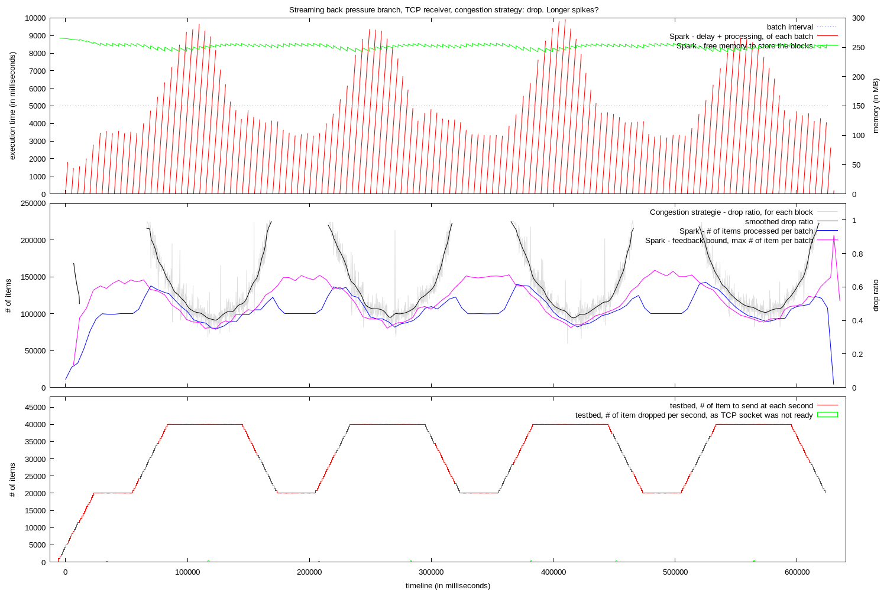

* Same behavior as in the previous test.
* With longer spikes (60 seconds), the system seem be able to stabilize while handling the spikes
* Needs more testing (see below).

## Streaming back pressure branch, TCP receiver, congestion strategy: drop. Longer-longer spikes?

Using [1.4.0-streaming-t006](https://downloads.typesafe.com/typesafe-spark/test/builds/spark-1.4.0-streaming-t006-bin-2.4.0.tgz). Test scenario 2, with spikes of 100 seconds.

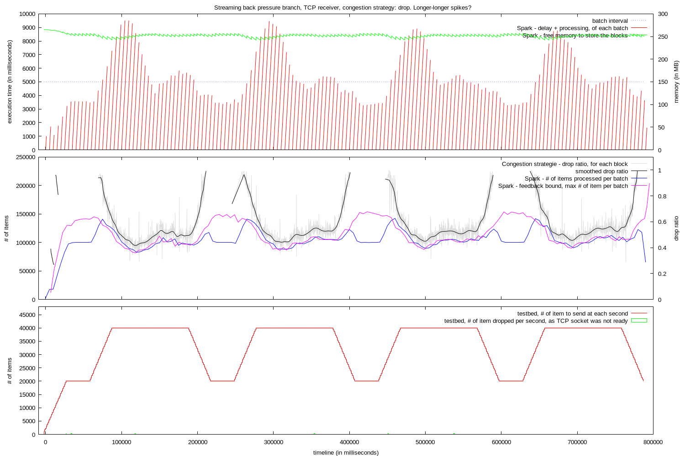

* Same behavior as in the previous test.
* With even longer spike (100 seconds), it is visible that the system adjusts the feedback bound value to handle the spikes, but the same behavior is repeated for each spike.

## Streaming back pressure branch, TCP receiver, congestion strategy: drop. Longer-longer spikes, less volume?

Using [1.4.0-streaming-t006](https://downloads.typesafe.com/typesafe-spark/test/builds/spark-1.4.0-streaming-t006-bin-2.4.0.tgz). Test scenario 3.
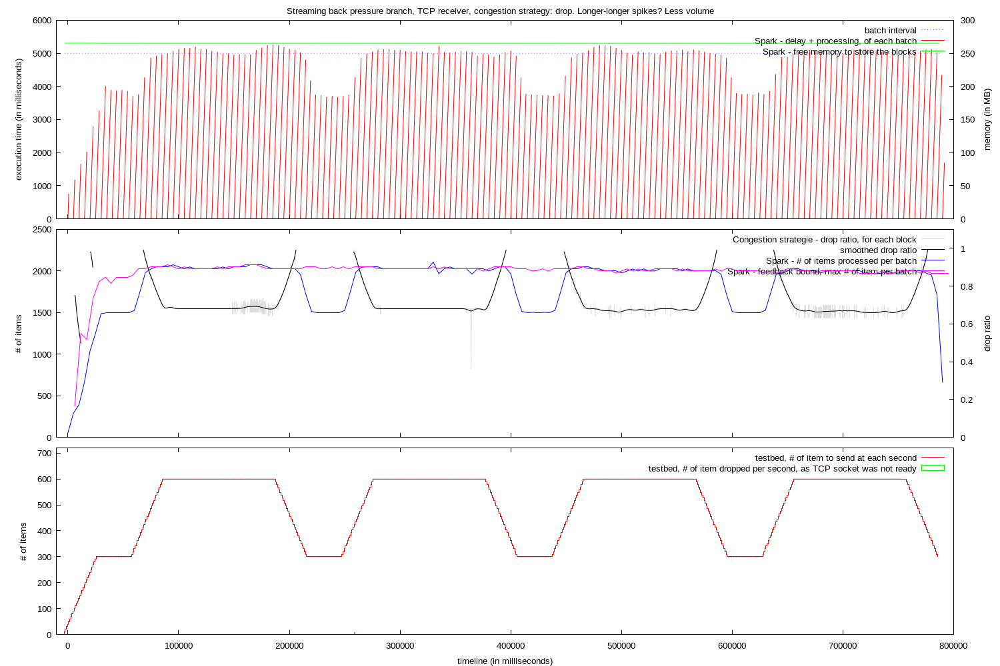

* This test was run with to check the idea that the big increase of input data (+ 20000 message per seconds) was the reason for the reason for the non-optimal initial feedback bound value, in the previous tests. These tests are run on a fairly small cluster, the big increase of input data could have an effect on the performance of the system.
* The Test scenario is basically the same as for the previous tests, but with a lower rate of input data (300/s-600/s vs 20k/s-40k/s)

&nbsp;

* The starting feedback bound value generated before the first spike seems fine. The same value is keep during the whole test
* During the spikes
  * The congestion strategy drops the extra data.
  * The execution time is at the batch interval.
  * No delay is accumulating.
* The test terminates correctly. The last batches of data are processed right after the test stopped pushing input data.

## Streaming back pressure branch, TCP receiver, congestion strategy: drop. Long spikes, constant volume, changing execution time

Using [1.4.0-streaming-t006](https://downloads.typesafe.com/typesafe-spark/test/builds/spark-1.4.0-streaming-t006-bin-2.4.0.tgz). Test scenario 4.

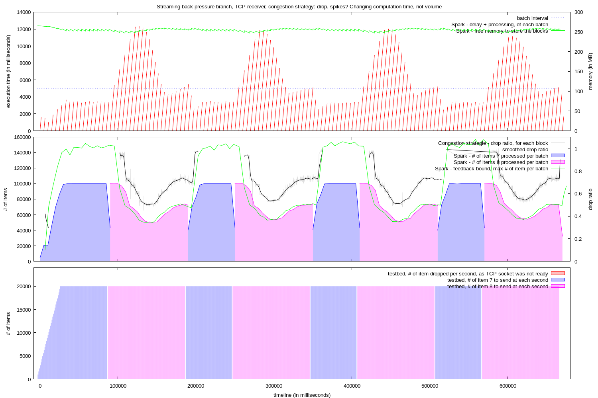

* This test was made to check the behavior of the system when the rate of input data is stable, but the execution time for one batch jump widely (about x2 execution time, using the resolution of the Tower of Hanoi with an height of 7 or 8).

&nbsp;

* When processing the 'fast-to-execute' batches, the system simply handle the load.
* When it shifts to the 'long-to-execute' batches
  * Some delay is accumulating
  * The feedback bound value is reduced greatly to reflect the change
  * The feedback bound value is reduced more, to reduce the accumulated delay
  * Once the accumulated delay is romeved, the feedback bound value is stabilized
* When it switches back to the 'fast-to-execute' batches, the feedback bound value revert to the previous level and is stabilized fast, as there is no delay to needed to be removed.
* The test terminates correctly. The last batches of data are processed right after the test stopped pushing input data.

## Streaming back pressure branch, TCP receiver, congestion strategy: pushback. Long spikes, low volume

Using [1.4.0-streaming-t006](https://downloads.typesafe.com/typesafe-spark/test/builds/spark-1.4.0-streaming-t006-bin-2.4.0.tgz). Test scenario 3, with lows of 100 seconds.

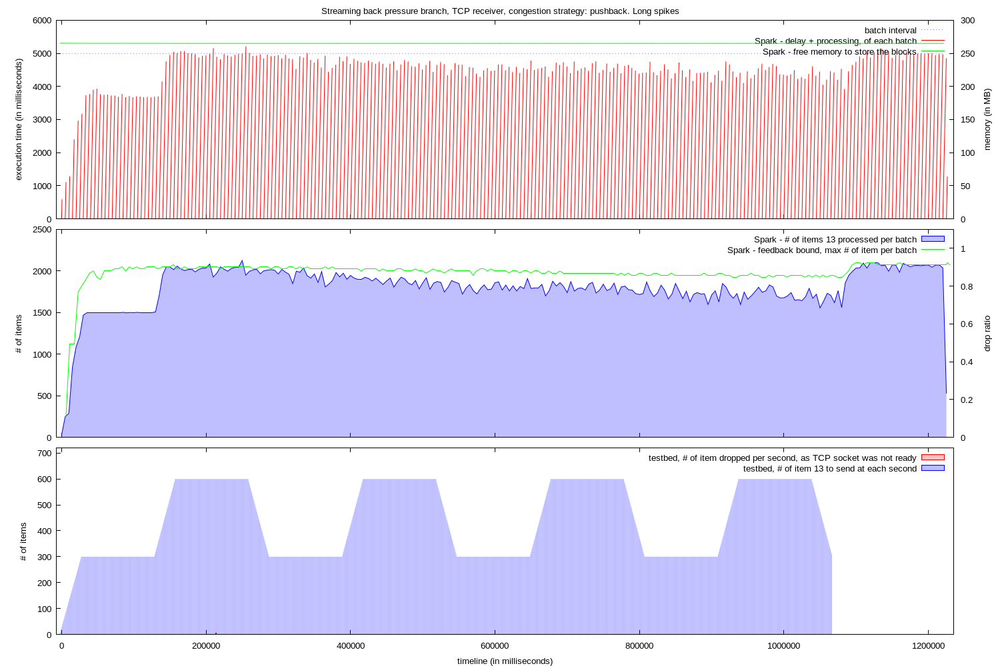

* Test to check the behavior of the system when using the pushback strategy when spikes occurs.

&nbsp;

* During the test ramp-up, a good feedback bound value is generated.
  * It is used through the test to limit the number of entries per batches
* When the first spike appears, the pushback strategy becomes active.
  * The input data is delayed
* When the spikes come and go, the system doesn't seem to accept the waiting data fast enough. The spikes are not visible anymore in the number of item processed per batches.
* The test is supposed to last about 1070 seconds, but because the TCP channel was filed up with data, it takes 160 more seconds to flush and process this data.

## Streaming back pressure branch, TCP receiver, congestion strategy: pushback. Long spikes, high volume

Using [1.4.0-streaming-t006](https://downloads.typesafe.com/typesafe-spark/test/builds/spark-1.4.0-streaming-t006-bin-2.4.0.tgz).  Test scenario 2, with spikes of 100 seconds and lows of 100 seconds.

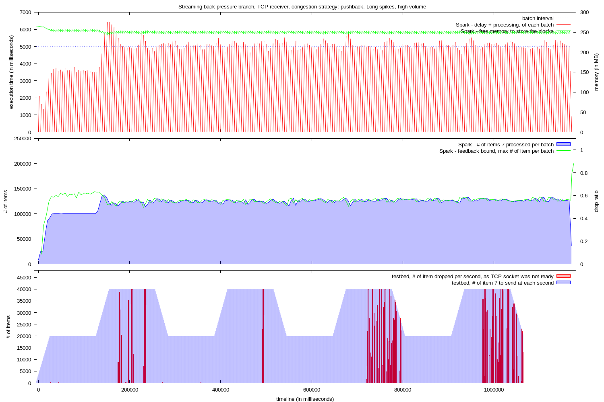

* Same test as the previous, but with high rate of input data.

&nbsp;

* The behavior is basically the same as the previous test, with in addition:
  * An excess in execution time and some delay accumulating on the first spike. Likely because of the additional resources taken to process the big increase of input data (and the same cluster used for the tests)
  * Pushback blocks reading the data from the socket, which accumulate in the TCP channel, up to the point when the testbed is no more able to add more to it, and it drops the excess data.

# Setup

The tests were executed on 3 m3.large ubuntu instances:

* 1 instance running the testbed application, providing the stream of data
* 2 instances running a 2 nodes Spark cluster:
  * node 1: Spark master + Spark slave
  * node 2: Spark streaming application + Spark slave\

## Test scenarios

The test scenario is run using the [testbed application](https://github.com/skyluc/spark-streaming-testbed/tree/master/testbed).

binary: [spark-streaming-testbed-0.1.2](https://downloads.typesafe.com/typesafe-spark/test/spark-streaming-testbed/spark-streaming-testbed-0.1.2.zip)

It is a Play/Akka application which pushes a stream of numbers to clients connected to a specific port. It logs the number of items it plans to sent during a second, and every time it is unable to push data in the TCP socket.

The test configuration is the following:

### Scenario 1

Simple.

Ramp up, followed by constant input

```
sequence = [
  { type = noop
    duration = 2
  }
  { type = ramp
    startRate = 1000
    endRate = 50000
    value = 7
    duration = 30
  }
  { type = fixed
    value = 7
    rate = 50000
    duration = 300
  }
]
```

### Scenario 2

Spikes.

The lows provide input data that the system can process without problem during the batch intervals. The highs are double the rate of input data, which is higher than what the system can process during the batch intervals.

```
sequence = [
  { type = noop
    duration = 2
  }
  { type = ramp
    startRate = 1000
    endRate = 20000
    value = 7
    duration = 30
  }
  { type = loop
    times = 4
    phases = [
      { type = fixed
        value = 7
        rate = 20000
        duration = 30   # lows duration 
      }
      { type = ramp
        startRate = 20000
        endRate = 40000
        value = 7
        duration = 30
      }
      { type = fixed
        value = 7
        rate = 40000
        duration = 100   # spikes duration
      }
      { type = ramp
        startRate = 40000
        endRate = 20000
        value = 7
        duration = 30
      }
    ]
  }
]
```


### Scenario 3

Low volume spikes.

The same as scenario 2, but with a general low volume of data. The value (items) sent have been increased, to keep an equivalent execution time for the batches.

```
sequence = [
  { type = noop
    duration = 2
  }
  { type = ramp
    startRate = 10
    endRate = 300
    value = 13
    duration = 30
  }
  { type = loop
    times = 4
    phases = [
      { type = fixed
        value = 13
        rate = 300
        duration = 30   # lows duration
      }
      { type = ramp
        startRate = 300
        endRate = 600
        value = 13
        duration = 30
      }
      { type = fixed
        value = 13
        rate = 600
        duration = 100  # spikes duration
      }
      { type = ramp
        startRate = 600
        endRate = 300
        value = 13
        duration = 30
      }
    ]
  }
]
```

### Scenario 4

Spikes with constant volume of data.

In this scenario, the rate of the data is kept constant, but the execution time is doubled during the spikes. This is done by increasing the value (item) which is sent.

```
sequence = [
  { type = noop
    duration = 2
  }
  { type = ramp
    startRate = 1000
    endRate = 20000
    value = 7
    duration = 30
  }
  { type = loop
    times = 4
    phases = [
      { type = fixed
        value = 7
        rate = 20000
        duration = 60
      }
      { type = fixed
        value = 8
        rate = 20000
        duration = 100
      }
    ]
  }
]
```

## Test streaming application


The test streaming application does a resolution of the tower of Hanoi problem, for each number of the input stream. The number is used as the height of the tower.

Then does some statistics on the data from the batch: for each distinct value received:

* the number of time the value appears in the batch,
* the accumulated processing time
* the average processing time
* the standard deviation of the processing time.

source: [simple-streaming-app](https://github.com/skyluc/spark-streaming-testbed/tree/master/simple-streaming-app)

binary: [simple-streaming-app_2.10-0.1.7.jar](https://downloads.typesafe.com/typesafe-spark/test/simple-streaming-app/simple-streaming-app_2.10-0.1.7.jar)

### Streaming application execution

The application is launched using: 

```bash
bin/spark-submit --class com.typesafe.spark.SimpleStreamingApp --master spark://<master_internal_ec2_hostname>:7077 <location/simple-streaming-app_2.10-0.1.7.jar> <testbed_ec2_internal_name> 2222 <congestion_strategy> 5000 | tee run.log
```

## Additional logs

Spark master, slaves and driver are running with the following additional configuration in `conf/log4j.properties`:

```
[...]
log4j.appender.console.target=System.out
[...]
log4j.appender.console.layout.ConversionPattern=%d{yyyy-MM-dd HH:mm:ss,SSSZ} %p %c{1}: %m%n
[...]

# Change this to set Spark log level
log4j.logger.org.apache.spark=WARN

log4j.logger.org.apache.spark.storage.BlockManagerInfo=INFO

log4j.logger.org.apache.spark.streaming.receiver.ReceiverSupervisorImpl=DEBUG

log4j.logger.org.apache.spark.streaming.receiver.DropCongestionStrategy=DEBUG
log4j.logger.org.apache.spark.streaming.receiver.SamplingCongestionStrategy=DEBUG
```

# Log processing

The used logs are:

* the output from the spark-submit command, stored in `run.log`, if using the command described earlier.
* the standard out of the executor running the streaming receiver, used to create `feedback.log`. 
  * To find the right log, look at the files `work/app-<timestamp>-<id>/./stdout` in the SPARK_HOME folder on all slave. The right one contains `ReceiverSupervisorImpl: Starting receiver` in the first 10 lines.
  * Use the following command to extract the interesting data:

    ```bash
    grep -e 'Received update' -e 'ratio'  work/app-*-0006/1/stdout > receiver.log
    ```

* the application log of the testbed application, available at `spark-streaming-testbed-0.1.1/logs/application.log`.

## Processing

The data has been processed by a simple Scala app which cleans the data, normalizes to a new zero time, and passes the data to gnuplot to generate the graphs.

source: [log-processor](https://github.com/skyluc/spark-streaming-testbed/tree/master/log-processor)

binary: [log-processor-0.0.2.tgz](https://downloads.typesafe.com/typesafe-spark/test/log-processor/log-processor-0.0.2.tgz)

It is run using:

```bash
bin/log-processor <location of a folder containing the 3 log files> <the graph title>
```

The resulting graph `graph.png` is in the same folder as the 3 base log files.
