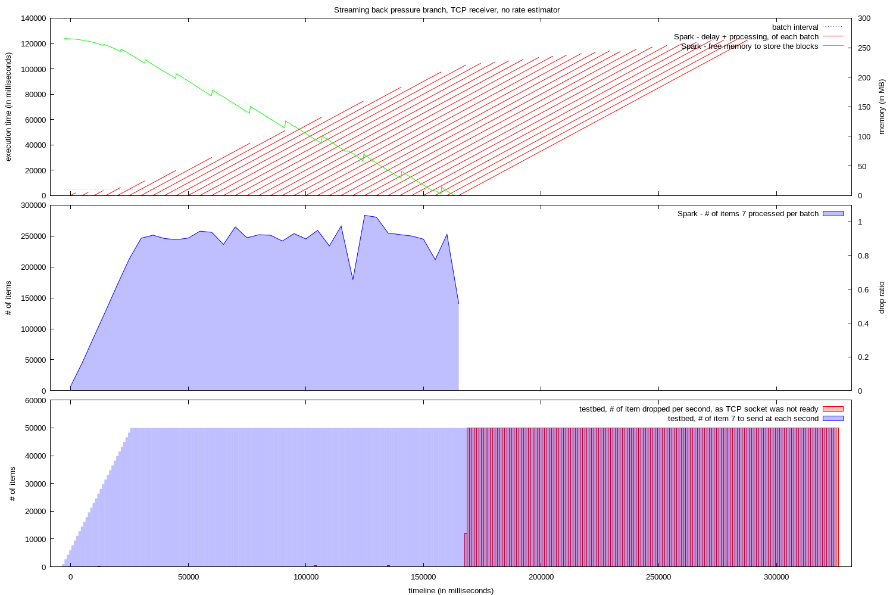
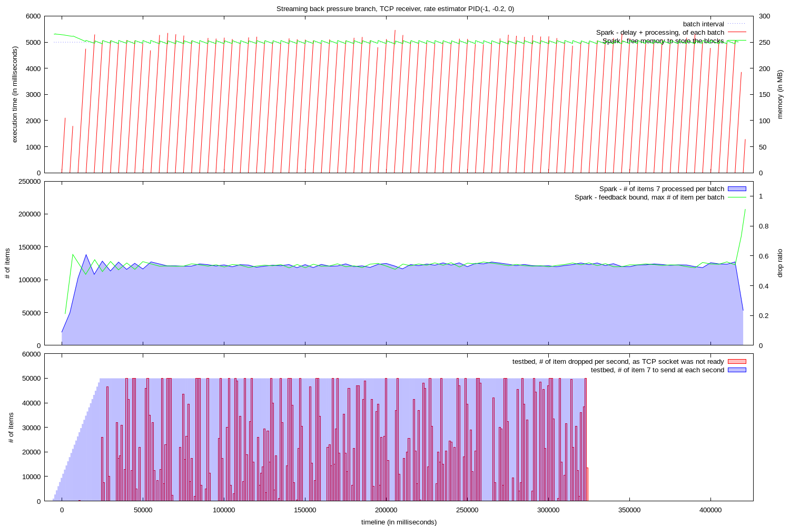
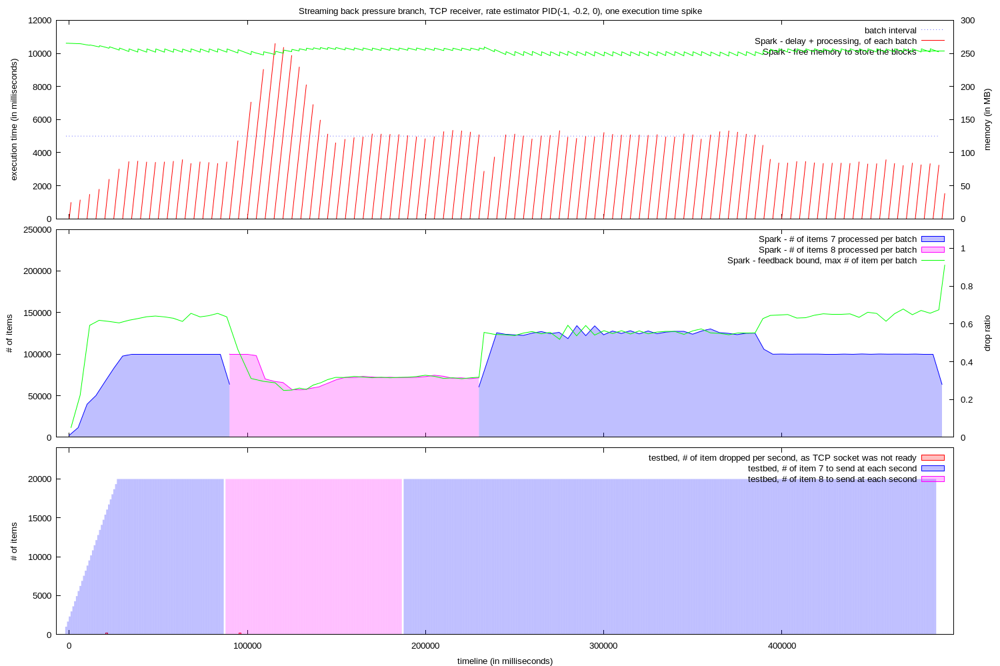
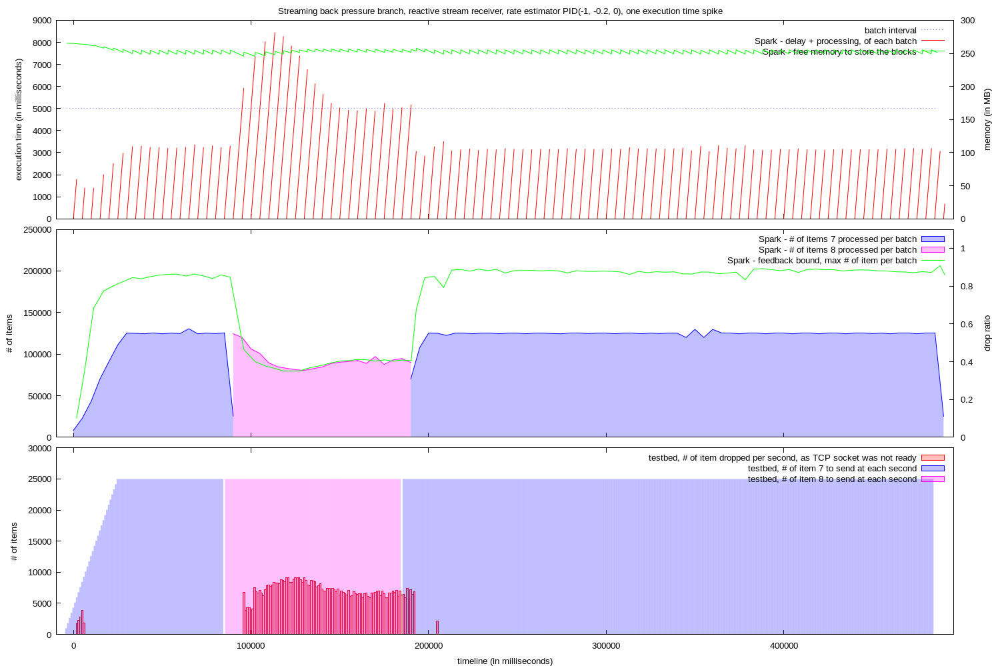
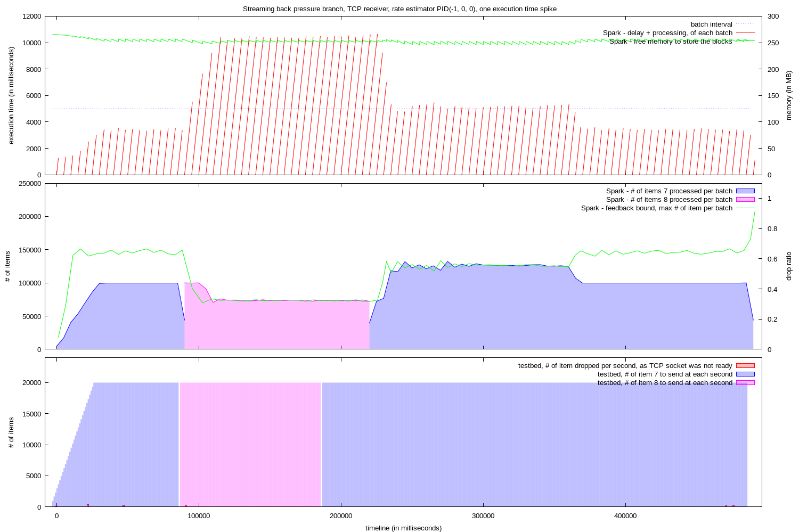
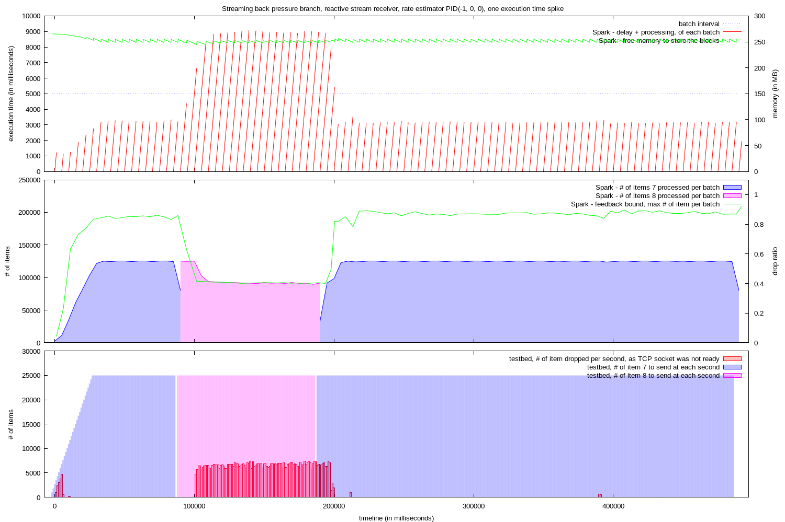
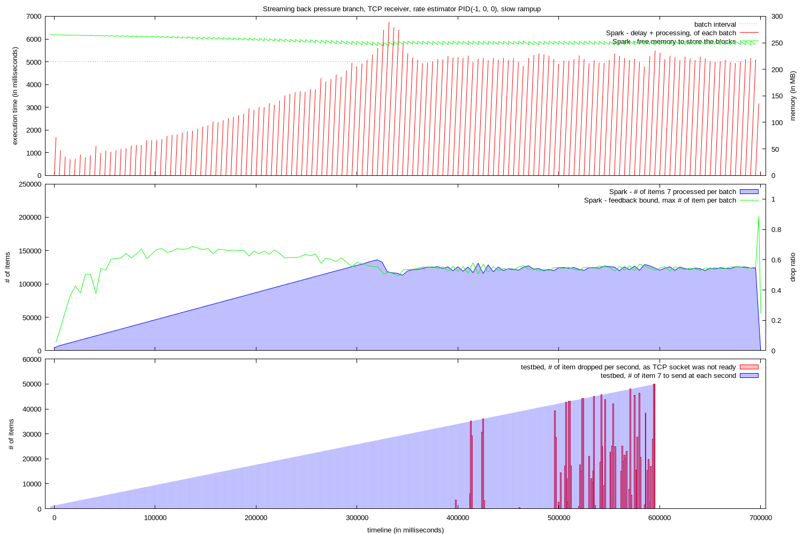
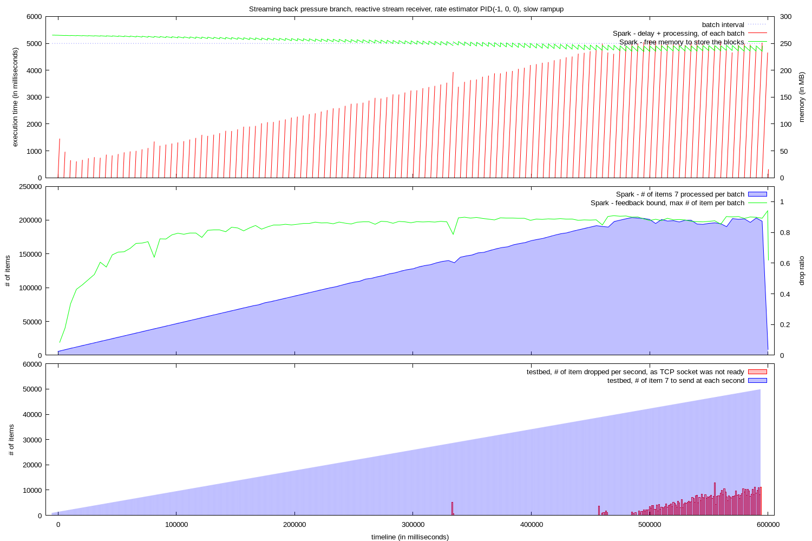

# Test runs

__For setup and all other details, look below__

## Vanilla Spark 1.4.0, TCP receiver, no congestion strategy

(not re-run)

## Streaming back pressure branch, TCP receiver, no rate estimator

* Using [1.4.0-streaming-t008](https://downloads.typesafe.com/typesafe-spark/test/builds/spark-1.4.0-streaming-t008-bin-2.4.0.tgz).
* Test scenario 1.
* Streaming test application without rate estimator.



* the job takes longer than the batch interval to run.
  * the delay is accumulating.
  * the amount of memory used to store the blocks to process increase.
* when the available memory to store the blocks reaches 0
  * blocks stop being created
  * the receiver stops processing the input
* shortly after, the data sent by the test bed fills up the TCP channel, and the testbed drops the remaining of the data.
* the data which was already stored in blocks is still processed, the last of this batches finishes with a delay of more than 100 seconds.

## Streaming back pressure branch, TCP receiver, rate estimator PID(-1, -0.2, 0)

* Using [1.4.0-streaming-t008](https://downloads.typesafe.com/typesafe-spark/test/builds/spark-1.4.0-streaming-t008-bin-2.4.0.tgz).
* Test scenario 1.
* Streaming test application with PID rate estimator (P= -1, I = -0.2, D= 0).



* During the test ramp-up, a good feedback bound value is generated.
  * It is used through the test to limit the number of entries per batches
* The jobs are executed without any real delay.
* The memory is stable
* A fair amount of data is drop by the testbed 
  * The strategy used to limit the size of the batches is to block the data coming from the input stream. It means that the 'excess' data is keep in the TCP channel.
  * When the TCP channel is 'full', The testbed drops the values it cannot push to the TCP socket.
* The processing of the data lasts about 100 more seconds than the test proper.
  * It is due to the fact that the is data pushed in the TCP socket, but not read right away by the receiver. When the test bed stops pushing data, the streaming job continues to process the cached data until the TCP channel is empty.

## Streaming back pressure branch, reactive stream receiver, rate estimator PID(-1, -0.2, 0)

* Using [1.4.0-streaming-t008](https://downloads.typesafe.com/typesafe-spark/test/builds/spark-1.4.0-streaming-t008-bin-2.4.0.tgz).
* Test scenario 1.
* Streaming test application with PID rate estimator (P= -1, I = -0.2, D= 0).


* During the test ramp-up, a good feedback bound value is generated.
  * It is used through the test to limit the number of entries per batches
* The jobs are executed without any real delay.
* The memory is stable
* A regular amount of data is drop by the testbed 
  * Using reactive streams, the streaming job tells the testbed how many entries it wishes to receive. The testbed fulfills these requests, and drops the excess of entries it would have liked to send. The streaming job request data according to the rate provided by the rate estimator.
* The test terminates correctly. The last batches of data are processed right after the test stopped pushing input data.

## Streaming back pressure branch, TCP receiver, rate estimator PID(-1, -0.2, 0), one execution time spike

* Using [1.4.0-streaming-t008](https://downloads.typesafe.com/typesafe-spark/test/builds/spark-1.4.0-streaming-t008-bin-2.4.0.tgz).
* Test scenario 2.
* Streaming test application with PID rate estimator (P= -1, I = -0.2, D= 0).



* During the test ramp-up, and the initial phase before the spike, a good feedback bound value is generated.
  * The input data can be processed faster that the batch interval, the system is working without delay.
* When the spike occurs, the system react to the fact that it takes longer to process the data contained in each batch. The feedback bound value is lowered to a level allowing to process the batch during the batch interval, then lowered more to reduce the accumulated delay.
  * Some delay accumulate at the beginning of the spike, but it is absorbed quickly.
* When the spike has past, the feedback bound value is reset to pre-spike value, and the remainder of the data processed.
* We can see a delay in execution of the input data.
  * The strategy used to limit the size of the batches is to block the data coming from the input stream. It means that the 'excess' data is keep in the TCP channel.
  * It takes about 30 seconds to finish process the data from the spike, after it was all pushed by the test bed.
  * It takes about 200 seconds to get back to a 'real time' processing state. During this period, the system process has fast as it can the data which was 'cached' in the TCP channel.
* The memory is stable
* The test terminates correctly. The last batches of data are processed right after the test stopped pushing input data.

## Streaming back pressure branch, reactive stream receiver, rate estimator PID(-1, -0.2, 0), one execution time spike

* Using [1.4.0-streaming-t008](https://downloads.typesafe.com/typesafe-spark/test/builds/spark-1.4.0-streaming-t008-bin-2.4.0.tgz).
* Test scenario 3.
* Streaming test application with PID rate estimator (P= -1, I = -0.2, D= 0).



* During the test ramp-up, and the initial phase before the spike, a good feedback bound value is generated.
  * The input data can be processed faster that the batch interval, the system is working without delay.
* When the spike occurs, the system react to the fact that it takes longer to process the data contained in each batch. The feedback bound value is lowered to a level allowing to process the batch during the batch interval, then lowered more to reduce the accumulated delay.
  * Some delay accumulate at the beginning of the spike, but it is absorbed quickly.
* When the spike has past, the feedback bound value is reset to pre-spike value, and the remainder of the data processed.
* There is no delay in processing the input data
  * The last of the data from the spike is processed right away when the spike ends.
* A regular amount of data is dropped by the testbed during the spike.
  * As the feedback bound value is reduced by the system, the less input is requested by the streaming job to the testbed.
  * The testbed drops the excess of entries it would have liked to send.
* The memory is stable
* The test terminates correctly. The last batches of data are processed right after the test stopped pushing input data.

## Streaming back pressure branch, TCP receiver, rate estimator PID(-1, 0, 0), one execution time spike

* Using [1.4.0-streaming-t008](https://downloads.typesafe.com/typesafe-spark/test/builds/spark-1.4.0-streaming-t008-bin-2.4.0.tgz).
* Test scenario 2.
* Streaming test application with PID rate estimator (P= -1, I = 0, D= 0).



* During the test ramp-up, and the initial phase before the spike, a good feedback bound value is generated.
  * The input data can be processed faster that the batch interval, the system is working without delay.
* When the spike occurs, the system react to the fact that it takes longer to process the data contained in each batch. The feedback bound value is lowered to a level allowing to process the batch during the batch interval.
  * Some delay accumulate at the beginning of the spike.
  * After the feedback bound value has been adjusted, the delay doesn't increase anymore, but it is not absorbed either.
* When the spike has past, the feedback bound value is reset to pre-spike value, and the remainder of the data processed.
* We can see a delay in execution of the input data.
  * The strategy used to limit the size of the batches is to block the data coming from the input stream. It means that the 'excess' data is keep in the TCP channel.
  * It takes about 30 seconds to finish process the data from the spike, after it was all pushed by the test bed.
  * It takes about 160 seconds to get back to a 'real time' processing state. During this period, the system process has fast as it can the data which was 'cached' in the TCP channel.
* The memory is stable
* The test terminates correctly. The last batches of data are processed right after the test stopped pushing input data.

## Streaming back pressure branch, reactive stream receiver, rate estimator PID(-1, 0, 0), one execution time spike

* Using [1.4.0-streaming-t008](https://downloads.typesafe.com/typesafe-spark/test/builds/spark-1.4.0-streaming-t008-bin-2.4.0.tgz).
* Test scenario 3.
* Streaming test application with PID rate estimator (P= -1, I = 0, D= 0).



* During the test ramp-up, and the initial phase before the spike, a good feedback bound value is generated.
  * The input data can be processed faster that the batch interval, the system is working without delay.
* When the spike occurs, the system react to the fact that it takes longer to process the data contained in each batch. The feedback bound value is lowered to a level allowing to process the batch during the batch interval.
  * Some delay accumulate at the beginning of the spike.
  * After the feedback bound value has been adjusted, the delay doesn't increase anymore, but it is not absorbed either.
* When the spike has past, the feedback bound value is reset to pre-spike value, and the remainder of the data processed.
* There is no delay in processing the input data
  * The last of the data from the spike is processed right away when the spike ends.
* A regular amount of data is dropped by the testbed during the spike.
  * As the feedback bound value is reduced by the system, the less input is requested by the streaming job to the testbed.
  * The testbed drops the excess of entries it would have liked to send.
* The memory is stable
* The test terminates correctly. The last batches of data are processed right after the test stopped pushing input data.

## Streaming back pressure branch, TCP receiver, rate estimator PID(-1, -0.2, 0), slow rampup

* Using [1.4.0-streaming-t008](https://downloads.typesafe.com/typesafe-spark/test/builds/spark-1.4.0-streaming-t008-bin-2.4.0.tgz).
* Test scenario 4.
* Streaming test application with PID rate estimator (P= -1, I = -0.2, D= 0).



* A fairly high feedback bound value is generated during the first 100 seconds, as the input rate increases.
* Up to 300 seconds in the test:
  * The feedback bound value decreases sightly.
  * The execution time increases in a non-linear fashion.
* At 300 seconds, the tested produces data faster than the job can process.
  * The execution time spikes, some low delay accumulate.
  * The feedback bound value is adjusted down, to manage the higher execution time, and the accumulated delay.
* After having managed the execution time spike, the resulting feedback bound value is significantly lower than the value at the beginning of the test.
* Some data is drop by the testbed
  * The strategy used to limit the size of the batches is to block the data coming from the input stream. It means that the 'excess' data is keep in the TCP channel.
  * As the input rate increase, the TCP channel become 'full', The testbed drops the values it cannot push to the TCP socket.
* The processing of the data lasts about 100 more seconds than the test proper.
  * It is due to the fact that the is data pushed in the TCP socket, but not read right away by the receiver. When the test bed stops pushing data, the streaming job continues to process the cached data until the TCP channel is empty.
* The memory is stable

## Streaming back pressure branch, reactive stream receiver, rate estimator PID(-1, -0.2, 0), slow rampup

* Using [1.4.0-streaming-t008](https://downloads.typesafe.com/typesafe-spark/test/builds/spark-1.4.0-streaming-t008-bin-2.4.0.tgz).
* Test scenario 4.
* Streaming test application with PID rate estimator (P= -1, I = -0.2, D= 0).



* A hight feedback bound value is generated during the first 100 seconds, as the input rate increases.
* Up to 450 seconds in the test:
  * The feedback bound value increases slightly.
  * The execution time increases in a linear fashion.
* From 450 second, the tested produces data faster than the job can process.
  * The streaming job starts to limit the amount of data it request, according to the feedback bound value.
  * The testbed drops the excess of entries it would have liked to send.
  * The execution time stays around the upper limit.
* The memory is stable
* The test terminates correctly. The last batches of data are processed right after the test stopped pushing input data.

# Setup

The tests were executed on 3 m3.large ubuntu instances:

* 1 instance running the testbed application, providing the stream of data
* 2 instances running a 2 nodes Spark cluster:
  * node 1: Spark master + Spark slave
  * node 2: Spark streaming application + Spark slave\

## Test scenarios

The test scenario is run using the [testbed application](https://github.com/skyluc/spark-streaming-testbed/tree/master/testbed).

binary: [spark-streaming-testbed-0.2.0](https://downloads.typesafe.com/typesafe-spark/test/spark-streaming-testbed/spark-streaming-testbed-0.2.0.tgz)

It is a Play/Akka application which pushes a stream of numbers to clients connected to a specific port. It logs the number of items it plans to sent during a second, and every time it is unable to push data in the TCP socket.

The test configuration is the following:

### Scenario 1

Simple.

Ramp up, followed by constant input

```
sequence = [
  { type = noop
    duration = 2
  }
  { type = ramp
    startRate = 1000
    endRate = 50000
    value = 7
    duration = 30
  }
  { type = fixed
    value = 7
    rate = 50000
    duration = 300
  }
]
```

### Scenario 2

Low volume spike.

The 'base' state is a stream of data which can be processed by the streaming job quicker than the batch interval. The 'spike' is a stream with the same rate of elements per second, but the value of each element is such that it would take longer than the batch interval to process the full batch of data.

```
sequence = [
  { type = noop
    duration = 2
  }
  { type = ramp
    startRate = 1000
    endRate = 20000
    value = 7
    duration = 30
  }
  { type = fixed
    value = 7
    rate = 20000
    duration = 60
  }
  { type = fixed
    value = 8
    rate = 20000
    duration = 100
  }
  { type = fixed
    value = 7
    rate = 20000
    duration = 300
  }
]
```

### Scenario 3

Low volume spike.

Same as scenario 2, with 25% more input, for the reactive stream receiver. Its performance appears to be better than the one of the default TCP receiver.

```
sequence = [
  { type = noop
    duration = 2
  }
  { type = ramp
    startRate = 1000
    endRate = 25000
    value = 7
    duration = 30
  }
  { type = fixed
    value = 7
    rate = 25000
    duration = 60
  }
  { type = fixed
    value = 8
    rate = 25000
    duration = 100
  }
  { type = fixed
    value = 7
    rate = 25000
    duration = 300
  }
]
```
### Scenario 4

Slow ramp-up to high input rate. The goal is to study the behavior of the system at different input rates.

sequence = [
  { type = noop
    duration = 2
  }
  { type = ramp
    startRate = 1000
    endRate = 50000
    value = 7
    duration = 600
  }
]

## Test streaming application


The test streaming application does a resolution of the tower of Hanoi problem, for each number of the input stream. The number is used as the height of the tower.

Then does some statistics on the data from the batch: for each distinct value received:

* the number of time the value appears in the batch,
* the accumulated processing time
* the average processing time
* the standard deviation of the processing time.

source: [simple-streaming-app](https://github.com/skyluc/spark-streaming-testbed/tree/master/simple-streaming-app)

binary: [simple-streaming-app-assembly-0.3.0.jar](https://downloads.typesafe.com/typesafe-spark/test/simple-streaming-app/simple-streaming-app-assembly-0.3.0.jar)

### Streaming application execution

The application is launched using, for the TCP receiver: 

```bash
bin/spark-submit --class com.typesafe.spark.SimpleStreamingApp --master spark://<master_internal_ec2_hostname>:7077 <location/simple-streaming-app-assembly-0.2.x.jar> -h <testbed_ec2_internal_name> -p 2222 -b 5000 -i '<p>,<i>,<d>' | tee ~/run.log
```

The application is launched using, for the reactive stream receiver: 

```bash
bin/spark-submit --class com.typesafe.spark.SimpleStreamingApp --master spark://<master_internal_ec2_hostname>:7077 <location/simple-streaming-app-assembly-0.2.x.jar> -h <testbed_ec2_internal_name> -r 2223 -b 5000 -i '<p>,<i>,<d>' | tee ~/run.log
```

## Additional logs

Spark master, slaves and driver are running with the following additional configuration in `conf/log4j.properties`:

```
[...]
log4j.appender.console.target=System.out
[...]
log4j.appender.console.layout.ConversionPattern=%d{yyyy-MM-dd HH:mm:ss,SSSZ} %p %c{1}: %m%n
[...]

# Change this to set Spark log level
log4j.logger.org.apache.spark=WARN

log4j.logger.org.apache.spark.storage.BlockManagerInfo=INFO

log4j.logger.org.apache.spark.streaming.receiver.ReceiverSupervisorImpl=DEBUG

log4j.logger.org.apache.spark.streaming.receiver.DropCongestionStrategy=DEBUG
log4j.logger.org.apache.spark.streaming.receiver.SamplingCongestionStrategy=DEBUG
```

# Log processing

The used logs are:

* the output from the spark-submit command, stored in `run.log`, if using the command described earlier.
* the standard out of the executor running the streaming receiver, used to create `feedback.log`. 
  * To find the right log, look at the files `work/app-<timestamp>-<id>/./stdout` in the SPARK_HOME folder on all slave. The right one contains `ReceiverSupervisorImpl: Starting receiver` in the first 10 lines.
  * Use the following command to extract the interesting data:

    ```bash
    grep -e 'Received update' -e 'ratio'  work/app-*-0006/1/stdout > receiver.log
    ```

* the application log of the testbed application, available at `spark-streaming-testbed-0.2.0/logs/application.log`.

## Processing

The data has been processed by a simple Scala app which cleans the data, normalizes to a new zero time, and passes the data to gnuplot to generate the graphs.

source: [log-processor](https://github.com/skyluc/spark-streaming-testbed/tree/master/log-processor)

binary: [log-processor-0.1.0.tgz](https://downloads.typesafe.com/typesafe-spark/test/log-processor/log-processor-0.1.0.tgz)

It is run using:

```bash
bin/log-processor <location of a folder containing the 3 log files> <the graph title>
```

The resulting graph `graph.png` is in the same folder as the 3 base log files.
